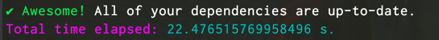
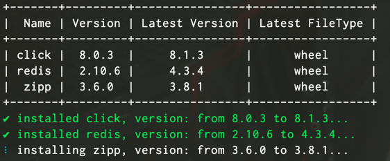
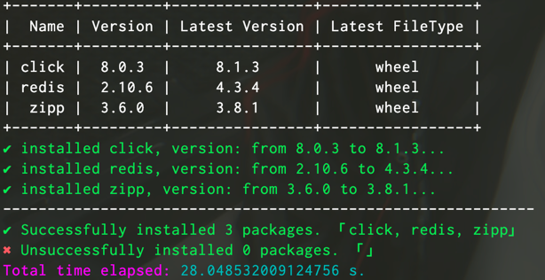

# pipu

Find the out-dated packages installed by the Pip tool and update them.

## Usage

First, you need to install dependencies.

if you don't have `poetry` tool, please install it first. 🔗: [poetry installation](https://python-poetry.org/docs/#installation), otherwise, install packages directly.

```bash
poetry install
```

and then, run `main.py` script.

```bash
python3 main.py
```

## ScreenShoot

* No packages need to be upgraded.



* Upgrade some expired packages.




